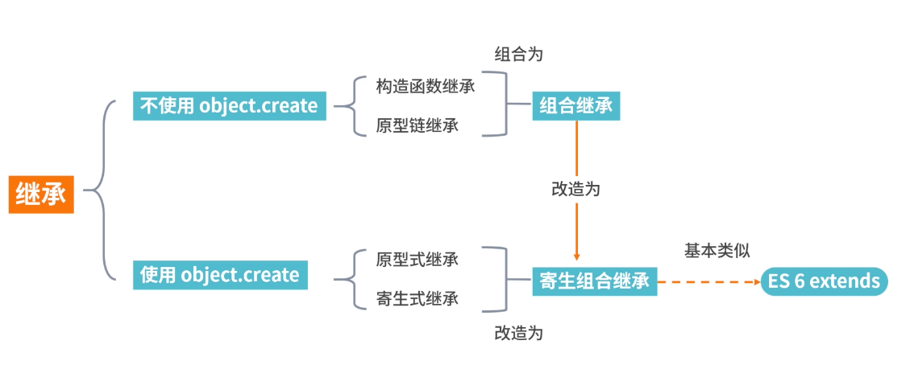

# 继承

## 原型链继承
- 内存空间是共享的，当一个发生变化的时候，另外一个也随之进行了变化，这就是使用原型链继承方式的一个缺点
```
function Parent1() {
  this.name = 'parent1';
  this.play = [1, 2, 3]
}
function Child1() {
  this.type = 'child1';
}
Child1.prototype = new Parent1();
console.log(new Child1()); // Child1 { type: "child1"}
// 明明我只改变了 s1 的 play 属性，为什么 s2 也跟着变了呢？原因很简单，因为两个实例使用的是同一个原型对象。它们的内存空间是共享的，当一个发生变化的时候，另外一个也随之进行了变化，这就是使用原型链继承方式的一个缺点。
var s1 = new Child1();
var s2 = new Child1();
s1.play.push(4);
console.log(s1.play); // [1, 2, 3, 4]
console.log(s2.play); // [1, 2, 3, 4]
```

## 构造函数继承（借助 call）
- 使父类的引用属性不会被共享，优化了第一种继承方式的弊端；但是随之而来的缺点也比较明显——只能继承父类的实例属性和方法，不能继承原型属性或者方法。
```
function Parent2(){
  this.name = 'parent2';
}
Parent2.prototype.getName = function () {
  return this.name;
}
function Child2(){
  Parent2.call(this);
  this.type = 'child2'
}
let child = new Child2();
console.log(child);  // 没问题 Child2 { name: "parent2", type: "child2"}
console.log(child.getName());  // 会报错 child.getName is not a function
```

## 组合继承（前两种组合）
- 这种方式结合了前两种继承方式的优缺点，结合起来的继承，代码如下。
- 通过注释我们可以看到 Parent3 执行了两次，第一次是改变Child3 的 prototype 的时候，第二次是通过 call 方法调用 Parent3 的时候，那么 Parent3 多构造一次就多进行了一次性能开销，这是我们不愿看到的。
```
function Parent3 () {
  this.name = 'parent3';
  this.play = [1, 2, 3];
}
Parent3.prototype.getName = function () {
  return this.name;
}
function Child3() {
  // 第二次调用 Parent3()
  Parent3.call(this);
  this.type = 'child3';
}
// 第一次调用 Parent3()
Child3.prototype = new Parent3();
// 手动挂上构造器，指向自己的构造函数
Child3.prototype.constructor = Child3;
var s3 = new Child3();
var s4 = new Child3();
s3.play.push(4);
// s3.play, s4.play 不互相影响
console.log(s3.play); // [1, 2, 3, 4]
console.log(s4.play); // [1, 2, 3]
console.log(s3.getName()); // 正常输出'parent3'
console.log(s4.getName()); // 正常输出'parent3'
```

## 原型式继承
- 这里不得不提到的就是 ES5 里面的 Object.create 方法，这个方法接收两个参数：一是用作新对象原型的对象、二是为新对象定义额外属性的对象（可选参数）。
- 从下面的代码中可以看到，通过 Object.create 这个方法可以实现普通对象的继承，不仅仅能继承属性，同样也可以继承 getName 的方法，请看这段代码的执行结果。
- 第三个结果“Parent4”也比较容易理解，s6 继承了 Parent4 的 name 属性，没有进行覆盖，因此输出父对象的属性。
- 最后两个输出结果是一样的，讲到这里你应该可以联想到 02 讲中浅拷贝的知识点，关于引用数据类型“共享”的问题，其实 Object.create 方法是可以为一些对象实现浅拷贝的。
- 缺点很明显，多个实例的引用类型属性指向相同的内存，存在篡改的可能。
```
let Parent4 = {
  name: "Parent4",
  play: [1, 2, 3],
  getName: function() {
    return this.name;
  }
};
let s5 = Object.create(Parent4);
s5.name = "s5";
s5.play.push(4);
let s6 = Object.create(Parent4);
s6.play.push(5);
console.log(s5.name); // s5
console.log(s5.name === s5.getName()); // true
console.log(s6.name); // Parent4
console.log(s5.play); // [1, 2, 3, 4, 5]
console.log(s6.play); // [1, 2, 3, 4, 5]
```

## 寄生式继承
- 使用原型式继承可以获得一份目标对象的浅拷贝，然后利用这个浅拷贝的能力再进行增强，添加一些方法，这样的继承方式就叫作寄生式继承。
- 虽然其优缺点和原型式继承一样，但是对于普通对象的继承方式来说，寄生式继承相比于原型式继承，还是在父类基础上添加了更多的方法。
- 最后两个输出结果是一样的，讲到这里你应该可以联想到 02 讲中浅拷贝的知识点，关于引用数据类型“共享”的问题，其实 Object.create 方法是可以为一些对象实现浅拷贝的。
- 通过 clone 的方法，在父类基础上添加了更多的方法。
```
let Parent5 = {
  name: "Parent5",
  play: [1, 2, 3],
  getName: function() {
    return this.name;
  }
};
function clone(original) {
  let clone = Object.create(original);
  clone.getPlay = function() {
    return this.play;
  };
  return clone;
}
let s7 = clone(Parent5);
s7.name = "s7";
s7.play.push(4);
let s8 = clone(Parent5);
console.log(s7.getName()); // s7
console.log(s8.getName()); // Parent5
console.log(s7.getPlay()); // [1, 2, 3, 4]
console.log(s7.play); // [1, 2, 3, 4]
console.log(s8.play); // [1, 2, 3, 4]
```

## 寄生组合式继承
- 解决普通对象的继承问题的 Object.create 方法，我们在前面这几种继承方式的优缺点基础上进行改造，得出了寄生组合式的继承方式，这也是所有继承方式里面相对最优的继承方式
- 通过这段代码可以看出来，这种寄生组合式继承方式，基本可以解决前几种继承方式的缺点，较好地实现了继承想要的结果，同时也减少了构造次数，减少了性能的开销
```
function clone (parent, child) {
  // 这里改用 Object.create 就可以减少组合继承中多进行一次构造的过程
  child.prototype = Object.create(parent.prototype);
  child.prototype.constructor = child;
}
function Parent6() {
  this.name = 'Parent6';
  this.play = [1, 2, 3];
}
Parent6.prototype.getName = function () {
  return this.name;
}
function Child6() {
  Parent6.call(this);
  this.friends = 'child5';
}

clone(Parent6, Child6);

Child6.prototype.getFriends = function () {
  return this.friends;
}

let s9 = new Child6();
console.log(s9); // Child6 { friends: "child5", name: "Parent6", play: [1, 2, 3]}
console.log(s9.getName()); // "Parent6"
console.log(s9.getFriends()); // "child5"
```

## ES6 的 extends 关键字实现逻辑
```
class Person {
  constructor(name) {
    this.name = name
  }
  // 原型方法
  // 即 Person.prototype.getName = function() { }
  // 下面可以简写为 getName() {...}
  getName = function () {
    console.log('Person:', this.name)
  }
}
class Gamer extends Person {
  constructor(name, age) {
    // 子类中存在构造函数，则需要在使用“this”之前首先调用 super()。
    super(name)
    this.age = age
  }
}
const asuna = new Gamer('Asuna', 20)
asuna.getName() // 成功访问到父类的方法
```

