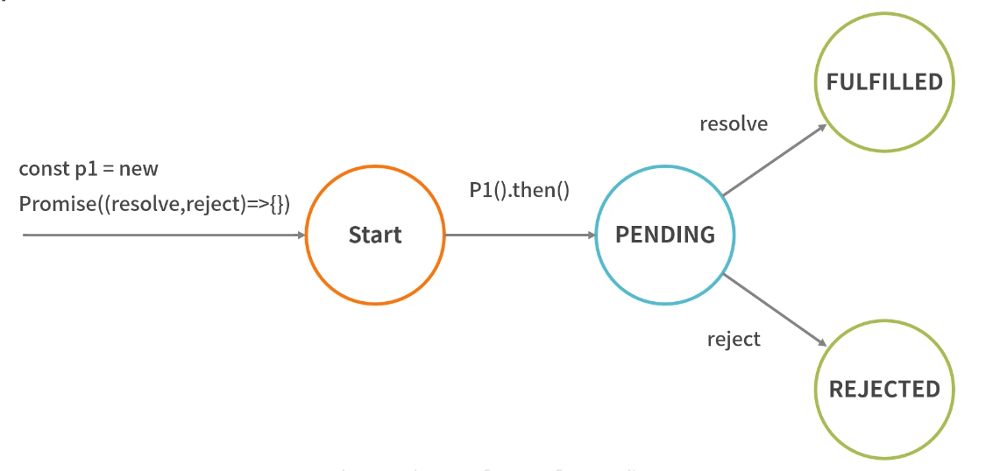

# Promise
- 简单来说它就是一个容器，里面保存着某个未来才会结束的事件（通常是异步操作）的结果。从语法上说，Promise 是一个对象，从它可以获取异步操作的消息。

| Promise方法        | 简结                                                |
| ----------------- | -------------------------------------------------- |
| **all**           | 所有结果为成功才返回成功，其中有一个失败方法时则进入失败方法 |
| **allSettled**    | 不论返回结果是否成功都返回每个参数都执行状态              |
| **any**           | 只要有一个成功，就返回执行结果                          |
| **race**          | 返回最先返回执行成功的执行结果                          |

```
function read(url) {
    return new Promise((resolve, reject) => {
        fs.readFile(url, 'utf8', (err, data) => {
            if(err) reject(err);
            resolve(data);
        });
    });
}
read(A).then(data => {
    return read(B);
}).then(data => {
    return read(C);
}).then(data => {
    return read(D);
}).catch(reason => {
    console.log(reason);
});
```

## 状态
- 待定（pending）：初始状态，既没有被完成，也没有被拒绝。
- 已完成（fulfilled）：操作成功完成。
- 已拒绝（rejected）：操作失败。

- 待定状态的 Promise 对象执行的话，最后要么会通过一个值完成，要么会通过一个原因被拒绝。当其中一种情况发生时，我们用 Promise 的 then 方法排列起来的相关处理程序就会被调用。因为最后 Promise.prototype.then 和 Promise.prototype.catch 方法返回的是一个 Promise， 所以它们可以继续被链式调用。

## Promise 如何解决回调地狱
- Promise 利用了三大技术手段来解决回调地狱：回调函数延迟绑定、返回值穿透、错误冒泡。
### 回调地狱有两个主要的问题
- 多层嵌套的问题；
- 每种任务的处理结果存在两种可能性（成功或失败），那么需要在每种任务执行结束后分别处理这两种可能性。
```
// 回调函数不是直接声明的，而是通过后面的 then 方法传入的，即延迟传入，这就是回调函数延迟绑定。
let readFilePromise = filename => {
  return new Promise((resolve, reject) => {
    fs.readFile(filename, (err, data) => {
      if (err) {
        reject(err)
      } else {
        resolve(data)
      }
    })
  })
}
readFilePromise('1.json').then(data => {
  return readFilePromise('2.json')
});
```
```
// 根据 then 中回调函数的传入值创建不同类型的 Promise，然后把返回的 Promise 穿透到外层，以供后续的调用。这里的 x 指的就是内部返回的 Promise，然后在 x 后面可以依次完成链式调用。这便是返回值穿透的效果
let x = readFilePromise('1.json').then(data => {
  return readFilePromise('2.json')  //这是返回的Promise
});
x.then(/* 内部逻辑省略 */)
```
```
// 结合
readFilePromise('1.json').then(data => {
    return readFilePromise('2.json');
}).then(data => {
    return readFilePromise('3.json');
}).then(data => {
    return readFilePromise('4.json');
}).catch(err => {
  // xxx
})
// 这样前面产生的错误会一直向后传递，被 catch 接收到，就不用频繁地检查错误了。从上面的这些代码中可以看到，Promise 解决效果也比较明显：实现链式调用，解决多层嵌套问题；实现错误冒泡后一站式处理，解决每次任务中判断错误、增加代码混乱度的问题。
```
## Promise 的静态方法
- all、allSettled、any、race 这四种方法
### Promise.all
- 语法： Promise.all（iterable）
- 参数： 一个可迭代对象，如 Array。
- 描述： 此方法对于汇总多个 promise 的结果很有用，在 ES6 中可以将多个 Promise.all 异步请求并行操作，返回结果一般有下面两种情况。
  - 当所有结果成功返回时按照请求顺序返回成功。
  - 当其中有一个失败方法时，则进入失败方法。
```
//1.获取轮播数据列表
function getBannerList(){
  return new Promise((resolve,reject)=>{
      setTimeout(function(){
        resolve('轮播数据')
      },300) 
  })
}
//2.获取店铺列表
function getStoreList(){
  return new Promise((resolve,reject)=>{
    setTimeout(function(){
      resolve('店铺数据')
    },500)
  })
}
//3.获取分类列表
function getCategoryList(){
  return new Promise((resolve,reject)=>{
    setTimeout(function(){
      resolve('分类数据')
    },700)
  })
}
function initLoad(){ 
  Promise.all([getBannerList(),getStoreList(),getCategoryList()])
  .then(res=>{
    console.log(res)
  }).catch(err=>{
    console.log(err)
  })
} 
initLoad()
```

### Promise.allSettled
- 语法： Promise.allSettled（iterable）
- 参数： 一个可迭代对象，如 Array。
- 描述： 此方法对于汇总多个 promise 的结果很有用，异步请求并行操作，返回结果不会失败。
  - 也就是说当 Promise.allSettled 全部处理完成后，我们可以拿到每个 Promise 的状态，而不管其是否处理成功。
```
const resolved = Promise.resolve(2);
const rejected = Promise.reject(-1);
const allSettledPromise = Promise.allSettled([resolved, rejected]);
allSettledPromise.then(function (results) {
  console.log(results);
});
// 返回结果：
// [
//    { status: 'fulfilled', value: 2 },
//    { status: 'rejected', reason: -1 }
// ]
```
### Promise.any
- 语法： Promise.any（iterable）
- 参数： iterable 可迭代的对象，例如 Array。
- 描述： any 方法返回一个 Promise，只要参数 Promise 实例有一个变成 fulfilled 状态，最后 any 返回的实例就会变成 fulfilled 状态；如果所有参数 Promise 实例都变成 rejected 状态，包装实例就会变成 rejected 状态。
```
const resolved = Promise.resolve(2);
const rejected = Promise.reject(-1);
const anyPromise = Promise.any([resolved, rejected]);
anyPromise.then(function (results) {
  console.log(results);
});
// 返回结果：
// 2
```

### Promise.race
- 语法： Promise.race（iterable）
- 参数： iterable 可迭代的对象，例如 Array。
- 描述： race 方法返回一个 Promise，只要参数的 Promise 之中有一个实例率先改变状态，则 race 方法的返回状态就跟着改变。那个率先改变的 Promise 实例的返回值，就传递给 race 方法的回调函数。
```
//请求某个图片资源
function requestImg(){
  var p = new Promise(function(resolve, reject){
    var img = new Image();
    img.onload = function(){ resolve(img); }
    img.src = 'http://www.baidu.com/img/flexible/logo/pc/result.png';
  });
  return p;
}
//延时函数，用于给请求计时
function timeout(){
  var p = new Promise(function(resolve, reject){
    setTimeout(function(){ reject('图片请求超时'); }, 5000);
  });
  return p;
}
Promise.race([requestImg(), timeout()])
.then(function(results){
  console.log(results);
})
.catch(function(reason){
  console.log(reason);
});
```
