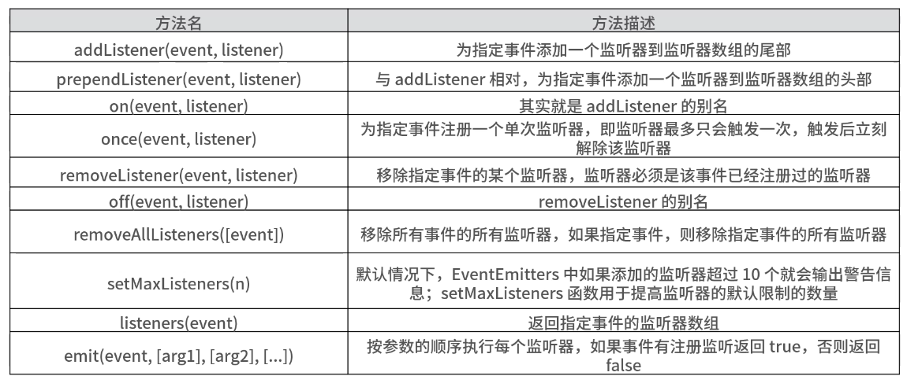
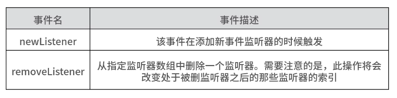

# EventEmitter
- Node.js的events 模块对外提供了一个 EventEmitter 对象，用于对 Node.js 中的事件进行统一管理。因为 Node.js 采用了事件驱动机制，而 EventEmitter 就是 Node.js 实现事件驱动的基础。在 EventEmitter 的基础上，Node.js 中几乎所有的模块都继承了这个类，以实现异步事件驱动架构。
```
// 定义的eventEmitter 是接收 events.EventEmitter 模块 new 之后返回的一个实例，eventEmitter 的 emit 方法，发出 say 事件，通过 eventEmitter 的 on 方法监听，从而执行相应的函数。
var events = require('events');
var eventEmitter = new events.EventEmitter();
eventEmitter.on('say',function(name){
    console.log('Hello',name);
})
eventEmitter.emit('say','Jonh');
```

## 常用的 EventEmitter 模块的 API
- 常用的 EventEmitter 模块的 API

- 两个特殊的事件，不需要额外手动添加


### addListener 和 removeListener、on 和 off 方法对比
- addListener 方法的作用是为指定事件添加一个监听器，其实和 on 方法实现的功能是一样的，on 其实就是 addListener 方法的一个别名。
- removeListener 方法的作用是为移除某个事件的监听器，同样 off 也是 removeListener 的别名。
```
var events = require('events');
var emitter = new events.EventEmitter();
function hello1(name){
  console.log("hello 1",name);
}
function hello2(name){
  console.log("hello 2",name);
}
emitter.addListener('say',hello1);
emitter.addListener('say',hello2);
emitter.emit('say','John');
//输出hello 1 John 
//输出hello 2 John
emitter.removeListener('say',hello1);
emitter.emit('say','John');
//相应的，监听say事件的hello1事件被移除
//只输出hello 2 John
```

### removeListener 和 removeAllListeners
- removeListener 方法是指移除一个指定事件的某一个监听器，而 removeAllListeners 指的是移除某一个指定事件的全部监听器。
```
var events = require('events');
var emitter = new events.EventEmitter();
function hello1(name){
  console.log("hello 1",name);
}
function hello2(name){
  console.log("hello 2",name);
}
emitter.addListener('say',hello1);
emitter.addListener('say',hello2);
emitter.removeAllListeners('say');
emitter.emit('say','John');
//removeAllListeners 移除了所有关于 say 事件的监听
//因此没有任何输出
```

### on 和 once 方法区别
- on 和 once 的区别是：on 的方法对于某一指定事件添加的监听器可以持续不断地监听相应的事件；而 once 方法添加的监听器，监听一次后，就会被消除。
```
var events = require('events');
var emitter = new events.EventEmitter();
function hello(name){
  console.log("hello",name);
}
emitter.on('say',hello);
emitter.emit('say','John');
emitter.emit('say','Lily');
emitter.emit('say','Lucy');
//会输出 hello John、hello Lily、hello Lucy，之后还要加也可以继续触发
emitter.once('see',hello);
emitter.emit('see','Tom');
//只会输出一次 hello Tom
```

## 实现一个 EventEmitter
- EventEmitter 是在Node.js 中 events 模块里封装的，那么在浏览器端实现一个这样的 EventEmitter 是否可以呢？
- 其实自己封装一个能在浏览器中跑的EventEmitter，并应用在你的业务代码中还是能带来不少方便的，它可以帮你实现自定义事件的订阅和发布，从而提升业务开发的便利性。
```
// EventEmitter的初始化代码
function EventEmitter() {
    this.__events = {}
}
EventEmitter.VERSION = '1.0.0';
```
```
// EventEmitter的 on 的方法
EventEmitter.prototype.on = function(eventName, listener){
	  if (!eventName || !listener) return;
      // 判断回调的 listener 是否为函数
	  if (!isValidListener(listener)) {
	       throw new TypeError('listener must be a function');
	  }
	   var events = this.__events;
	   var listeners = events[eventName] = events[eventName] || [];
	   var listenerIsWrapped = typeof listener === 'object';
       // 不重复添加事件，判断是否有一样的
       if (indexOf(listeners, listener) === -1) {
           listeners.push(listenerIsWrapped ? listener : {
               listener: listener,
               once: false
           });
       }
	   return this;
};
// 判断是否是合法的 listener
 function isValidListener(listener) {
     if (typeof listener === 'function') {
         return true;
     } else if (listener && typeof listener === 'object') {
         return isValidListener(listener.listener);
     } else {
         return false;
     }
}
// 顾名思义，判断新增自定义事件是否存在
function indexOf(array, item) {
     var result = -1
     item = typeof item === 'object' ? item.listener : item;
     for (var i = 0, len = array.length; i < len; i++) {
         if (array[i].listener === item) {
             result = i;
             break;
         }
     }
     return result;
}
```

```
// emit 方法
EventEmitter.prototype.emit = function(eventName, args) {
     // 直接通过内部对象获取对应自定义事件的回调函数
     var listeners = this.__events[eventName];
     if (!listeners) return;
     // 需要考虑多个 listener 的情况
     for (var i = 0; i < listeners.length; i++) {
         var listener = listeners[i];
         if (listener) {
             listener.listener.apply(this, args || []);
             // 给 listener 中 once 为 true 的进行特殊处理
             if (listener.once) {
                 this.off(eventName, listener.listener)
             }
         }
     }
     return this;
};

EventEmitter.prototype.off = function(eventName, listener) {
     var listeners = this.__events[eventName];
     if (!listeners) return;
     var index;
     for (var i = 0, len = listeners.length; i < len; i++) {
	    if (listeners[i] && listeners[i].listener === listener) {
           index = i;
           break;
        }
    }
    // off 的关键
    if (typeof index !== 'undefined') {
         listeners.splice(index, 1, null)
    }
    return this;
};
```
```
// once 方法和 alloff方法
EventEmitter.prototype.once = function(eventName, listener）{
    // 直接调用 on 方法，once 参数传入 true，待执行之后进行 once 处理
     return this.on(eventName, {
         listener: listener,
         once: true
     })
 };
EventEmitter.prototype.allOff = function(eventName) {
     // 如果该 eventName 存在，则将其对应的 listeners 的数组直接清空
     if (eventName && this.__events[eventName]) {
         this.__events[eventName] = []
     } else {
         this.__events = {}
     }
};
```
## 总结
- EventEmitter 采用的正是发布-订阅模式
  - 另外，观察者模式和发布-订阅模式有些类似的地方，但是在细节方面还是有一些区别的，你要注意别把这两个模式搞混了。发布-订阅模式其实是观察者模式的一种变形，区别在于：发布-订阅模式在观察者模式的基础上，在目标和观察者之间增加了一个调度中心。
- 在 Vue 框架中不同组件之间的通讯里，有一种解决方案叫 EventBus。和 EventEmitter的思路类似，它的基本用途是将 EventBus 作为组件传递数据的桥梁，所有组件共用相同的事件中心，可以向该中心注册发送事件或接收事件，所有组件都可以收到通知，使用起来非常便利，其核心其实就是发布-订阅模式的落地实现。
