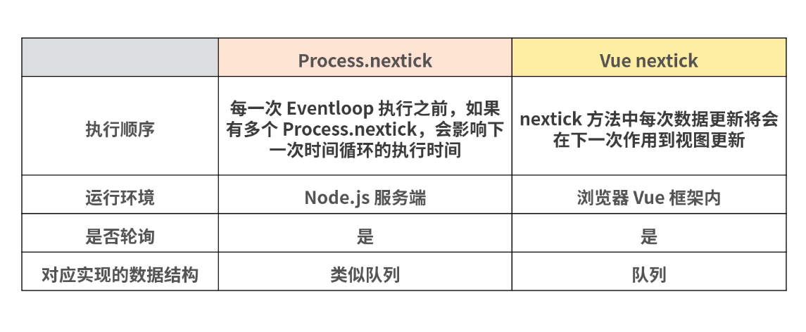

# Process.nextick



## 基本语法
- Process.nextick 的语法有两个参数：
```
// 其中，第一个参数是 callback 回调函数，第二个参数是 args 调用 callback 时额外传的参数，是可选参数。
process.nextTick(callback[, ...args])
```
- Process.nextick 的运行逻辑：
  - Process.nextick 会将 callback 添加到“next tick queue”；
  - “next tick queue”会在当前 JavaScript stack 执行完成后，下一次 event loop 开始执行前按照 FIFO 出队；
  - 如果递归调用 Process.nextick 可能会导致一个无限循环，需要去适时终止递归。

- Process.nextick 其实是微任务，同时也是异步 API 的一部分。但是从技术上来说 Process.nextick 并不是事件循环（eventloop）的一部分，相反地，“next tick queue”将会在当前操作完成之后立即被处理，而不管当前处于事件循环的哪个阶段。
- 如果任何时刻你在一个给定的阶段调用 Process.nextick，则所有被传入 Process.nextick 的回调将在事件循环继续往下执行前被执行。这可能会导致一些很糟的情形，因为它允许用户递归调用 Process.nextick 来挂起 I/O 进程的进行，这会导致事件循环永远无法到达轮询阶段。

## 为什么使用 Process.nextTick()
- 一部分原因是设计理念，Node.js 中的 API 应该总是异步的，即使是那些不需要异步的地方。
```
// 通过上面的代码检查参数，如果检查不通过，它将一个错误对象传给回调。Node.js API 最近进行了更新，其已经允许向 Process.nextick 中传递参数来作为回调函数的参数，而不必写嵌套函数。
// 我们所做的就是将一个错误传递给用户，但这只允许在用户代码被执行完毕后执行。使用 Process.nextick 我们可以保证 apicall() 的回调总是在用户代码被执行后，且在事件循环继续工作前被执行。为了达到这一点，JS 调用栈被允许展开，然后立即执行所提供的回调。该回调允许用户对 Process.nextick 进行递归调用，而不会达到 RangeError，即 V8 调用栈的最大值。
function apiCall(arg, callback) {
  if (typeof arg !== 'string')
  return process.nextTick(callback, new TypeError('argument should be     string'));
}
```
```
// 用户定义函数 someAsyncApiCall() 有一个异步签名，但实际上它是同步执行的。当它被调用时，提供给 someAsyncApiCall() 的回调函数会在执行 someAsyncApiCall() 本身的同一个事件循环阶段被执行，因为 someAsyncApiCall() 实际上并未执行任何异步操作。结果就是，即使回调函数尝试引用变量 bar，但此时在作用域中并没有改变量。因为程序还没运行到对 bar 赋值的部分。
let bar;
function someAsyncApiCall(callback) { callback(); }
someAsyncApiCall(() => {
  console.log('bar', bar);   // undefined
});
bar = 1;
```
- 将回调放到 Process.nextick 中，程序依然可以执行完毕，且所有的变量、函数等都在执行回调之前被初始化，它还具有不会被事件循环打断的优点。以下是将上面的例子改用 Process.nextick 的代码：
```
let bar;
function someAsyncApiCall(callback) {
  process.nextTick(callback);
}
someAsyncApiCall(() => {
  console.log('bar', bar); // 1
});
bar = 1;
```
- 因为 Node.js 直接有 event 模块，其实就是一个 EventEmitter，下面代码是在造函数中触发一个事件：
```
const EventEmitter = require('events');
const util = require('util');
 
function MyEmitter() {
EventEmitter.call(this);
this.emit('event');
}
util.inherits(MyEmitter, EventEmitter);
 
const myEmitter = new MyEmitter();
myEmitter.on('event', () => {
console.log('an event occurred!');
});
```
- 你无法在构造函数中立即触发一个事件，因为此时程序还未运行到将回调赋值给事件的那段代码。因此，在构造函数内部，你可以使用 Process.nextick 设置一个回调以在构造函数执行完毕后触发事件，下面的代码满足了我们的预期。
```
const EventEmitter = require('events');
const util = require('util');
 
function MyEmitter() {
EventEmitter.call(this);
process.nextTick(() => {
  this.emit('event');
});
}
util.inherits(MyEmitter, EventEmitter);
 
const myEmitter = new MyEmitter();
  myEmitter.on('event', () => {
  console.log('an event occurred!');
});
```
- 通过上面的改造可以看出，使用 Process.nextick 就可以解决问题了，即使 event 事件还没进行绑定，但也可以让代码在前面进行触发，因为根据代码执行顺序，Process.nextick 是在每一次的事件循环最后执行的。因此这样写，代码也不会报错，同样又保持了代码的逻辑。

## Vue 的 nextick 又是什么意思？
- Vue 异步执行 DOM 的更新。当数据发生变化时，Vue 会开启一个队列，用于缓冲在同一事件循环中发生的所有数据改变的情况。如果同一个 watcher 被多次触发，只会被推入到队列中一次。这种在缓冲时去除重复数据对于避免不必要的计算和 DOM 操作上非常重要。然后在下一个的事件循环“tick”中。例如：当你设置 vm.someData = 'new value'，该组件不会立即重新渲染。当刷新队列时，组件会在事件循环队列清空时的下一个“tick”更新。多数情况我们不需要关心这个过程，但是如果你想在 DOM 状态更新后做点什么，这就可能会有些棘手。
- Vue 中 nextick 的源码。在 Vue 2.5+ 之后的版本中，有一个单独的 JS 文件来维护，路径是在 src/core/util/next-tick.js 中，源码如下：
```
/* @flow */
	/* globals MutationObserver */
	
	import { noop } from 'shared/util'
	import { handleError } from './error'
	import { isIE, isIOS, isNative } from './env'
	
	export let isUsingMicroTask = false
	
	const callbacks = []
	let pending = false
	
	function flushCallbacks () {
	  pending = false
	  const copies = callbacks.slice(0)
	  callbacks.length = 0
	  for (let i = 0; i < copies.length; i++) {
	    copies[i]()
	  }
	}
	
	// Here we have async deferring wrappers using microtasks.
	// In 2.5 we used (macro) tasks (in combination with microtasks).
	// However, it has subtle problems when state is changed right before repaint
	// (e.g. #6813, out-in transitions).
	// Also, using (macro) tasks in event handler would cause some weird behaviors
	// that cannot be circumvented (e.g. #7109, #7153, #7546, #7834, #8109).
	// So we now use microtasks everywhere, again.
	// A major drawback of this tradeoff is that there are some scenarios
	// where microtasks have too high a priority and fire in between supposedly
	// sequential events (e.g. #4521, #6690, which have workarounds)
	// or even between bubbling of the same event (#6566).
	let timerFunc
	
	// The nextTick behavior leverages the microtask queue, which can be accessed
	// via either native Promise.then or MutationObserver.
	// MutationObserver has wider support, however it is seriously bugged in
	// UIWebView in iOS >= 9.3.3 when triggered in touch event handlers. It
	// completely stops working after triggering a few times... so, if native
	// Promise is available, we will use it:
	/* istanbul ignore next, $flow-disable-line */
	if (typeof Promise !== 'undefined' && isNative(Promise)) {
	  const p = Promise.resolve()
	  timerFunc = () => {
	    p.then(flushCallbacks)
	    // In problematic UIWebViews, Promise.then doesn't completely break, but
	    // it can get stuck in a weird state where callbacks are pushed into the
	    // microtask queue but the queue isn't being flushed, until the browser
	    // needs to do some other work, e.g. handle a timer. Therefore we can
	    // "force" the microtask queue to be flushed by adding an empty timer.
	     if (isIOS) setTimeout(noop)
	  }
	  isUsingMicroTask = true
	} else if (!isIE && typeof MutationObserver !== 'undefined' && (
	  isNative(MutationObserver) ||
	  // PhantomJS and iOS 7.x
	  MutationObserver.toString() === '[object MutationObserverConstructor]'
	)) {
	  // Use MutationObserver where native Promise is not available,
	  // e.g. PhantomJS, iOS7, Android 4.4
	  // (#6466 MutationObserver is unreliable in IE11)
	  let counter = 1
	  const observer = new MutationObserver(flushCallbacks)
	  const textNode = document.createTextNode(String(counter))
	  observer.observe(textNode, {
	    characterData: true
	  })
	  timerFunc = () => {
	    counter = (counter + 1) % 2
	    textNode.data = String(counter)
	  }
	  isUsingMicroTask = true
	} else if (typeof setImmediate !== 'undefined' && isNative(setImmediate)) {
	  // Fallback to setImmediate.
	  // Technically it leverages the (macro) task queue,
	  // but it is still a better choice than setTimeout.
	  timerFunc = () => {
	    setImmediate(flushCallbacks)
	  }
	} else {
	  // Fallback to setTimeout.
	  timerFunc = () => {
	    setTimeout(flushCallbacks, 0)
	  }
	}
	
	export function nextTick (cb?: Function, ctx?: Object) {
	  let _resolve
	  callbacks.push(() => {
	    if (cb) {
	      try {
	        cb.call(ctx)
	      } catch (e) {
	        handleError(e, ctx, 'nextTick')
	      }
	    } else if (_resolve) {
	      _resolve(ctx)
	    }
	  })
	  if (!pending) {
	    pending = true
	    timerFunc()
	  }
	  // $flow-disable-line
	  if (!cb && typeof Promise !== 'undefined') {
	    return new Promise(resolve => {
	      _resolve = resolve
	    })
	  }
	}
```
- 核心在于 timerFunc 这个函数的逻辑实现，timerFunc 这个函数采用了好几种处理方式，主要是针对系统以及 Promise 的支持几个情况同时进行兼容性处理。处理逻辑情况是这样的：
  - 首先判断是否原生支持 Promise，支持的话，利用 promise 来触发执行回调函数；
  - 如果不支持 Promise，再判断是否支持 MutationObserver，如果支持，那么生成一个对象来观察文本节点发生的变化，从而实现触发执行所有回调函数；
  - 如果 Promise 和 MutationObserver 都不支持，那么使用 setTimeout 设置延时为 0。

